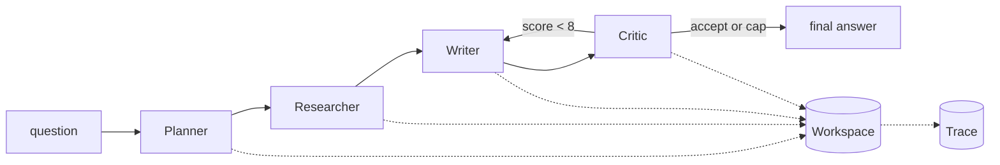

# multi-agent-orchestrator — a multi-agent loop you can read, step through, and trace

[](https://github.com/darrshangovender/multi-agent-orchestrator/actions/workflows/tests.yml)
[](LICENSE)
[](https://python.org)
[](https://docs.pydantic.dev)

> A small, production-shaped framework for role-based agent systems. Agents have explicit roles, exchange **structured Pydantic handoffs** rather than freeform text, share a named-slot workspace instead of a replayed transcript, and emit a trace event for every handoff, tool call and model call. Ships with a planner–researcher–writer–critic pipeline.

**Why this exists.** Most agent frameworks are either too magic — the control flow disappears into a graph DSL — or too thin, and you re-implement the orchestration loop every project. This exposes the loop as code you can set a breakpoint in, while abstracting the parts that deserve it: typed handoffs, workspace memory, tool registration, and tracing.

---

## Quick start

```bash
pip install -e ".[anthropic,dev]"     # or ".[openai,dev]"
export ANTHROPIC_API_KEY=...
python examples/research_demo.py
```

```python
from orchestrator import Orchestrator, Workspace, tool
from orchestrator.agents import Planner, Researcher, Writer, Critic
from orchestrator.tools import web_search

@tool(description="Look up an internal doc by id.")
def get_doc(doc_id: str, max_chars: int = 2000) -> dict:
    return {"id": doc_id, "text": "..."}

orch = Orchestrator(
    agents={
        "planner":    Planner(model="claude-sonnet-4-5"),
        "researcher": Researcher(tools=[web_search, get_doc]),
        "writer":     Writer(model="claude-sonnet-4-5"),
        "critic":     Critic(model="claude-opus-4-7", max_revisions=2),
    },
    workspace=Workspace(initial={"tenant": "acme"}),
)

final = orch.run("What is the difference between RAG and fine-tuning?")
print(final.final_answer, final.critic_score, len(final.sources))
print(final.trace.summary())    # events · llm_calls · tokens · cost
```

## How it works



1. `run()` builds a typed `PlanInput` and calls `step("planner", ...)`.
2. `step()` emits `handoff_in`, opens a timed span, runs the agent, **type-checks the return**, applies its workspace writes, and emits `handoff_out`.
3. The planner decomposes the question into sub-questions in the workspace.
4. The researcher calls its `web_search` tool once per sub-question and writes structured sources.
5. The write/critique loop runs up to `max_revisions + 1` times: the writer reads sources and prior feedback, the critic scores against a fixed rubric and decides revise or accept.
6. The loop breaks on acceptance or the revision cap.
7. Every model call emits an `llm_call` event carrying model, tokens, cost and duration.

## The four agents

| Agent | Handoff in → out | What it does |
|---|---|---|
| `Planner` | `PlanInput` → `PlanOutput` | One call at temperature 0.3; decomposes into 3–6 sub-questions with reasoning |
| `Researcher` | `ResearchInput` → `ResearchOutput` | **No model call** — loops the sub-questions through the `web_search` tool and builds `Source` models |
| `Writer` | `WriteInput` → `WriteOutput` | Reads `sources` and `critic_feedback` from the workspace; drafts at temperature 0.5 |
| `Critic` | `CriticInput` → `CriticOutput` | Fixed four-part rubric out of 10, accepts at ≥ 8.0; owns the revision cap |

Workspace slots written along the way: `sub_questions`, `plan_reasoning`, `sources`, `contradictions`, `draft`, `draft_revision`, `citation_count`, `critic_score`, `critic_feedback`, `critic_accept`.

## Design decisions

| Decision | Why |
|---|---|
| **Structured handoffs, not freeform text** | Every agent declares its input and output as Pydantic models. Invalid output fails at the boundary instead of quietly propagating — no "the model returned something odd and we kept going". |
| **A workspace, not a message history** | Agents read and write named slots. It saves tokens (no replaying the whole conversation), enforces a real shape (sources, drafts, scores each live somewhere), and makes debugging trivial because every state is a snapshot. |
| **A trace, not logs** | Every handoff, tool call and model call is a structured event with timestamps, tokens and cost. You can replay a run, roll up its spend, or export it. |
| **A hard revision cap** | Without one, a critic that keeps rejecting drafts runs forty times and bills you for it. |
| **No LangGraph** | LangGraph is excellent but hides the loop in a graph DSL. Shipping into someone else's codebase, you want the opposite: a loop they can step through in a debugger and change with a normal PR. |

## Limitations

- **There is no LLM tool-calling loop.** The `to_anthropic_schema()` / `to_openai_schema()` methods are never called anywhere in the repo, and the LLM client has no `tools` parameter. The researcher calls `web_search` directly in a Python `for` loop. Tool *registration* is real; tool *dispatch by the model* is not implemented. This is the single largest gap between what the framework looks like and what it does.
- **The demo's sources are fabricated.** `web_search` returns `Result {i} for {query}` at `example.com`, and `_flag_contradictions` returns an empty list unconditionally. The pipeline runs end to end and produces a well-structured answer cited entirely to placeholders.
- **Validation is weaker than advertised.** `step()` checks only that the agent returned an `AgentResult`. It never verifies the inner result matches the agent's declared output schema, and nothing checks the handoff type matches what the agent expects. The real validation is the Pydantic construction inside each agent's own `run()`.
- **`max_total_iterations` is dead.** It is stored and never read. The only loop bound is the critic's `max_revisions` — and a pipeline built without an agent keyed `"critic"` will raise `AttributeError` reaching for it.
- **Trace timing double-counts.** The total sums every event's duration, including both the agent-level span and the nested model calls inside it, so `summary()` overstates wall clock. The span stack is also unbalanced on failure: `step()` re-raises without closing the span, corrupting timing for the rest of the run.
- **No resilience in the model path.** A brand-new provider client is constructed on every call, with no retry, backoff, timeout, or rate-limit handling. A single 429 propagates out of `run()` and the partial workspace and trace are lost. Provider selection is a `model.startswith("claude-")` string test, so Bedrock, Vertex and Azure model ids route to the wrong SDK.
- **Everything is sequential and in-memory.** The workspace is an unbounded dict retaining every value ever written, including full drafts; the trace is an unbounded list. There is no checkpointing, so a crash mid-run loses the whole pipeline. Parallel fan-out for independent sub-tasks is the obvious next step and is not built.
- **Cost is silently zero for unpriced models** — the price lookup returns `None` and the rollup coalesces it away, so `summary()` reports `$0.0000` for anything outside the small hardcoded table.
- **The sample run output has been removed from this README.** It quoted source counts, word counts, revision scores, call counts, latency and dollar cost. None of it is traceable — there is no fixture, recording, benchmark or eval in this repo that produces those numbers.

## Project layout

```
multi-agent-orchestrator/
├── orchestrator/
│   ├── core.py          # Orchestrator · Workspace · Handoff · Result · AgentResult
│   ├── agent.py         # Agent base: system prompt, model call, trace emission
│   ├── llm.py           # provider-portable client + price table
│   ├── tools.py         # @tool decorator + registry + demo web_search
│   ├── trace.py         # structured events, cost/token rollups, summary
│   └── agents/          # planner · researcher · writer · critic
├── examples/            # research_demo.py (needs a real API key)
└── tests/               # 5 tests
```

## Tests

```bash
pytest tests/ -q         # 5 tests
```

Honest state: the suite covers workspace get/set with actor attribution, Pydantic rejection of an invalid handoff, output defaults, and the orchestrator's type check on agent returns. Nothing touches `Trace`, the tool registry, schema generation, the LLM client, or any agent's `run()` — which is where most of the limitations above live. CI runs it on every push.

## Author

Darrshan Govender · [Agulhas Code](https://agulhascode.co.za) · Durban, South Africa
